# mamory-front
오픈소스 프론트 섹션
# Mapmory

----------
### 팀원소개
> ## BackEnd  
> ### - 김준석 : 회원가입, 로그인 API 구현   
> ### - 박재연 : 다이어리, 마커 API 구현, 서버 배포
> ## FrontEnd
> ### - 박찬욱 : 지도, 마커 다이어리 UI 구현
> ### - 임화랑 : 회원가입, 로그인 API 구현

## 프로젝트 메뉴얼

-------------
- ### 메인 화면

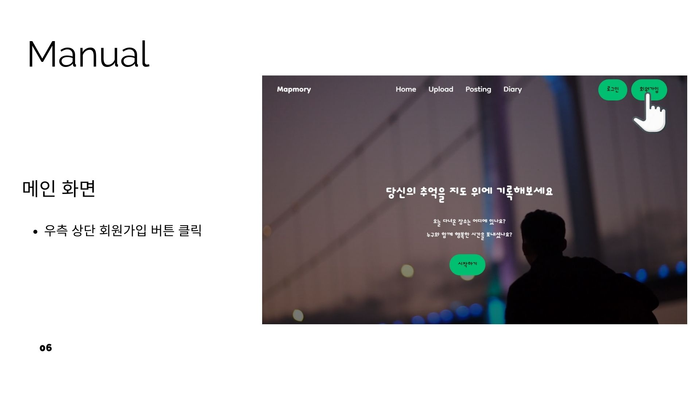
> - 우측 상단 회원가입 버튼 클릭 시 회원가입 화면으로 이동
-----------------
- ### 회원 가입
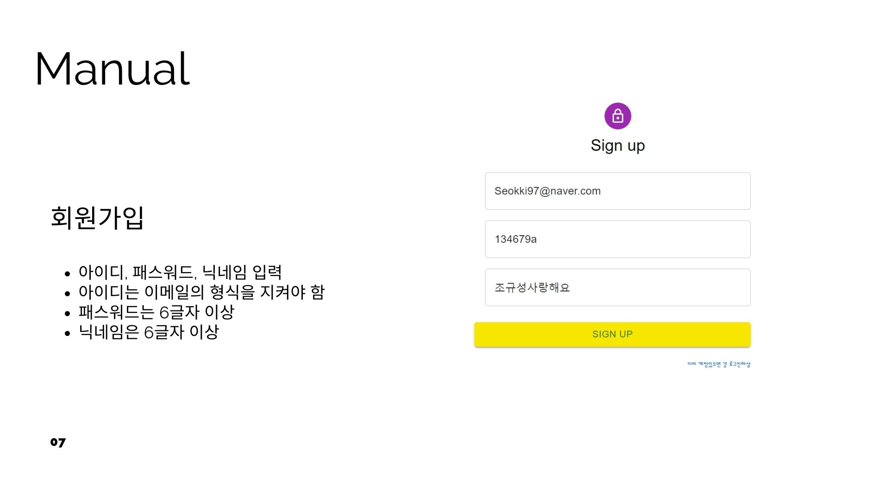
> - 아이디, 패스워드 , 닉네임 입력
> - 아이디는 반드시 이메일의 형식으로 지켜야 함
> - 패스워드는 6글자 이상, 닉네임은 4글자 이상으로 정해야 함
> - 다른 User와 이메일 혹은 닉네임이 중복될 시 가입이 안됨
---------------------

- ### 설치 메뉴얼

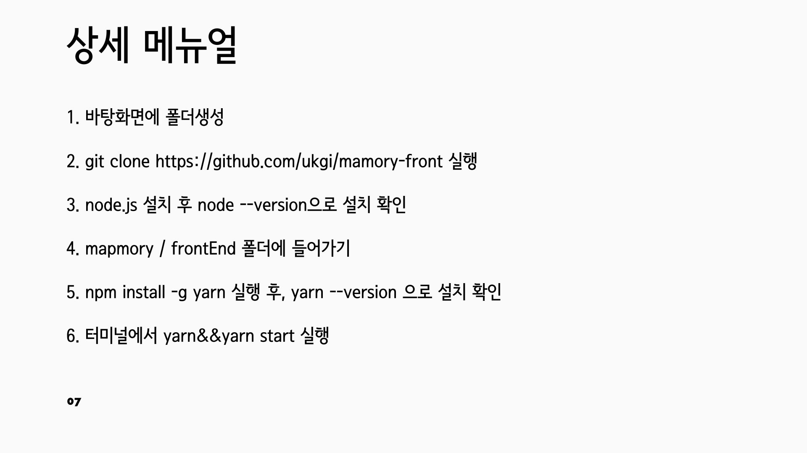
----------------------
-------------------

- ### 로그인
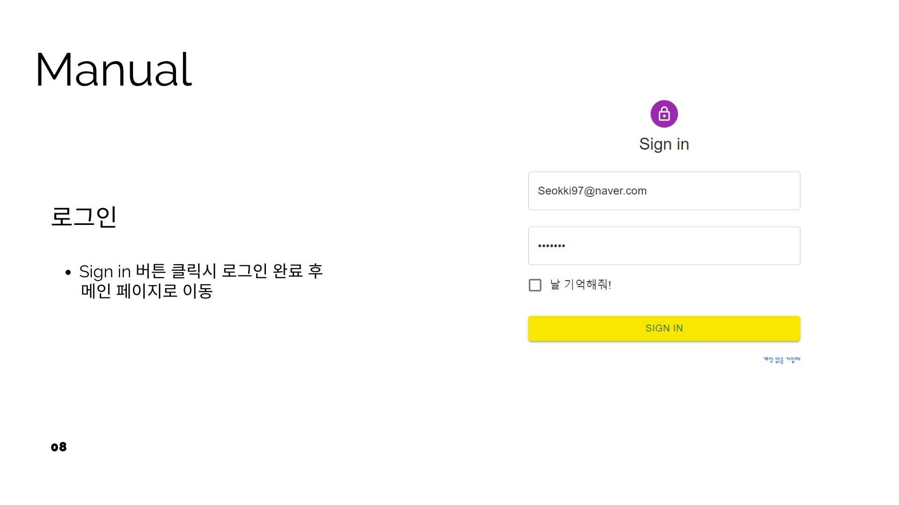
> - 앞서 회원가입 한 정보를 입력하면 로그인 완료

------------------
- ###  로그인 완료

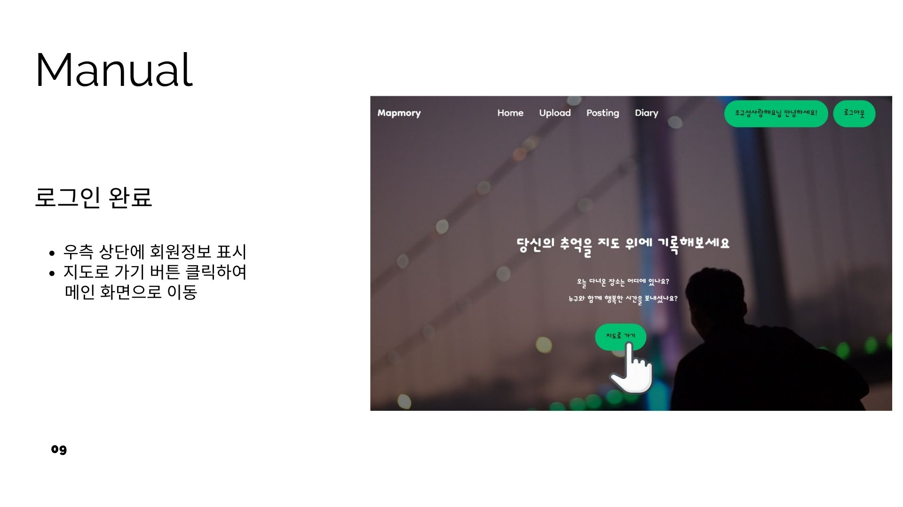

> - 지도로 가기 버튼 클릭시 메인 화면(MAP)으로 이동
---------------------
- ### 메인 화면으로 이동
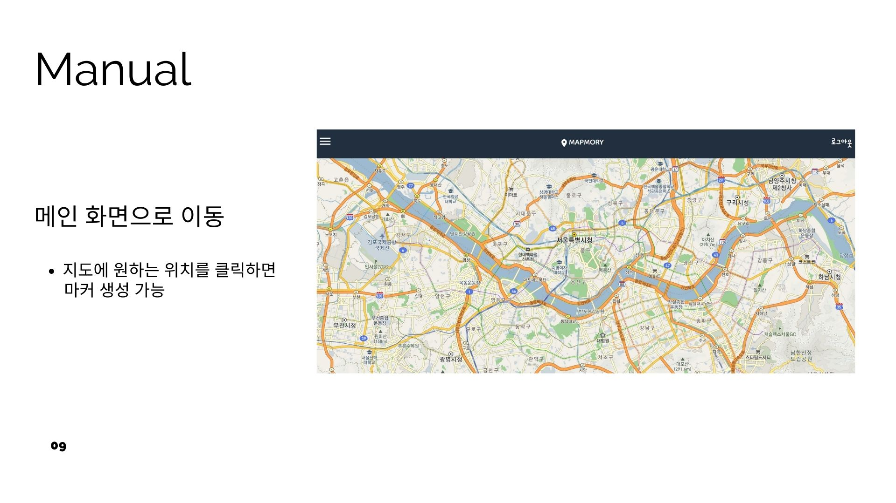

> - 지도에 본인이 원하는 장소 클릭 시 마커 생성
---------------------
- ### 마커 생성

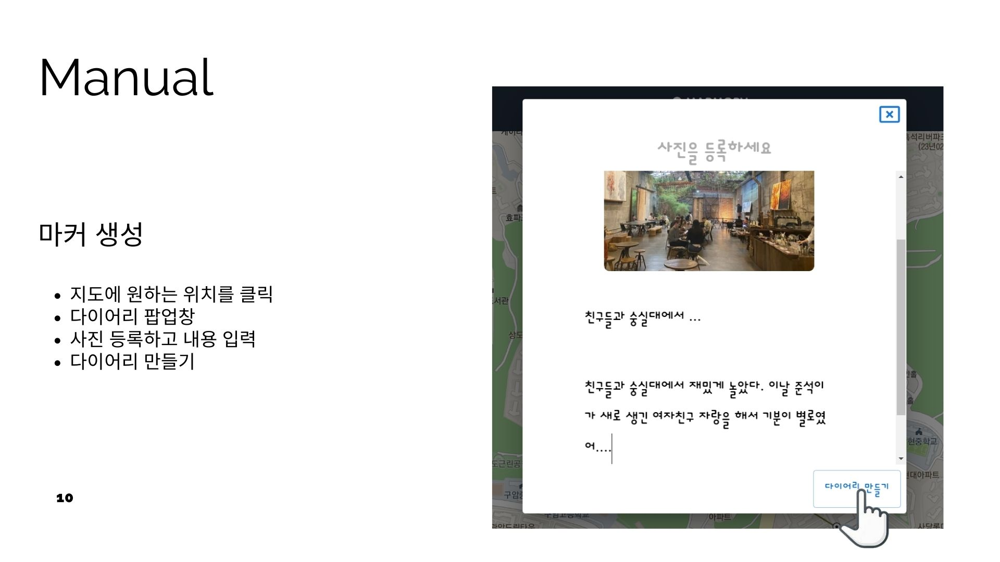

> - 마커가 생성되면 사진과 제목과 내용을 등록하고, 다이어리 만들기 버튼 클릭
----------------------

- ### 마커 생성 확인

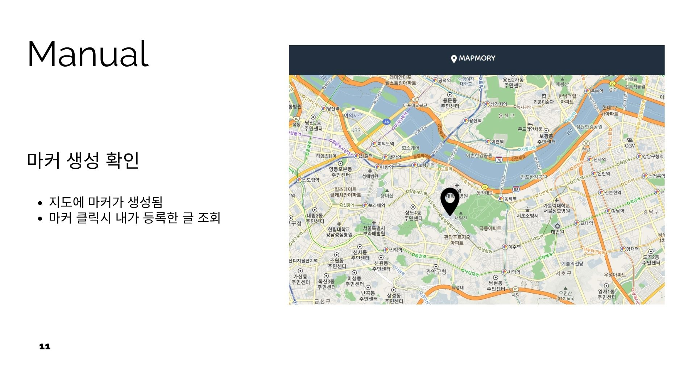

> - 마커가 생성된 것을 확인
---------------------
- ### 내가 쓴 추억 조회 
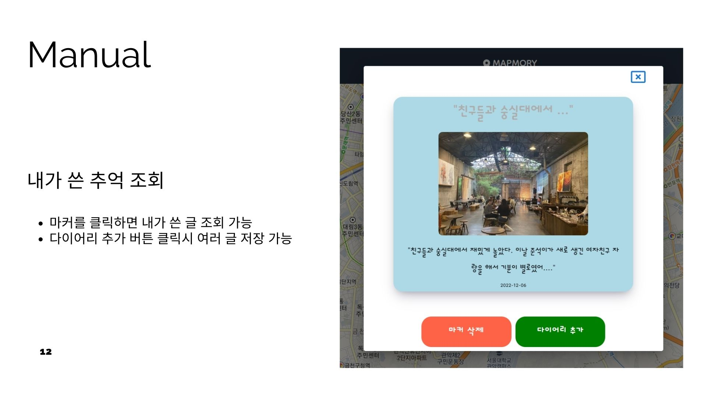

> - 등록했던 마커를 클릭하여 쓴 글 조회 가능
> - 다이어리 추가 버튼 클릭시 여러 글 저장 가능
-----------------------
- ### 여러 추억 저장

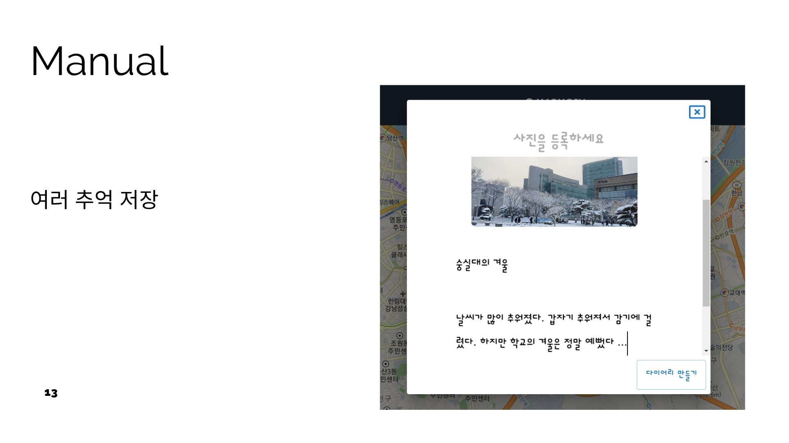
> - 한 마커에 여러 추억들을 등록할 수 있음

---------------------
- ### 여러 추억 저장 확인
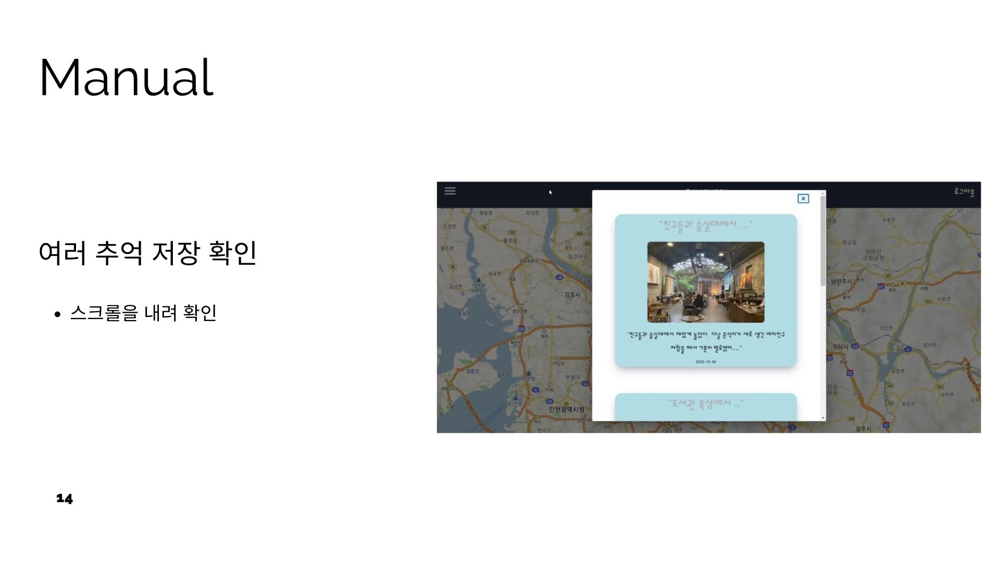

> - 여러 추억이 저장되었는지 확인

-------------------
- ### 마커 삭제

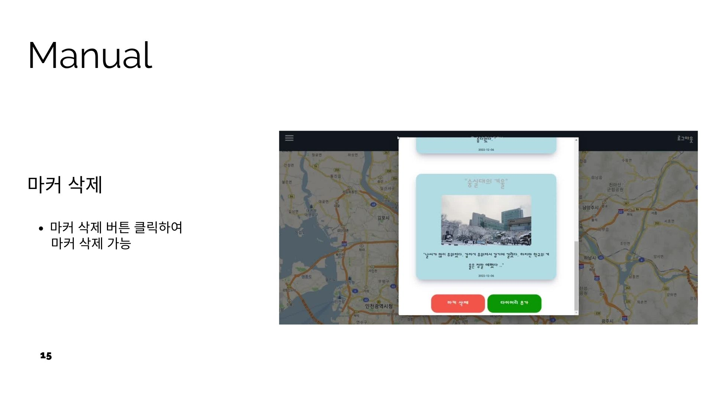
--------------------
> - 마커 삭제 버튼을 클릭하여 마커를 삭제할 수 있음
- ### 마커 자동 생성
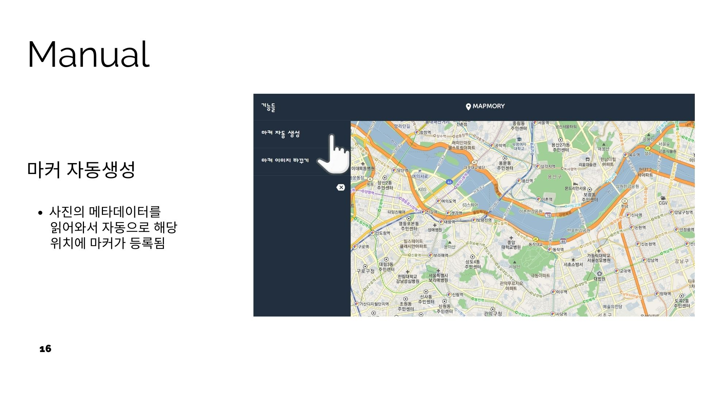
> - 온쪽 상단에 마커 자동 생성 버튼을 클릭하면 메타데이터(위도,경도)가 있는 사진들의 위치에
--------------------

- ### 마커 자동 생성

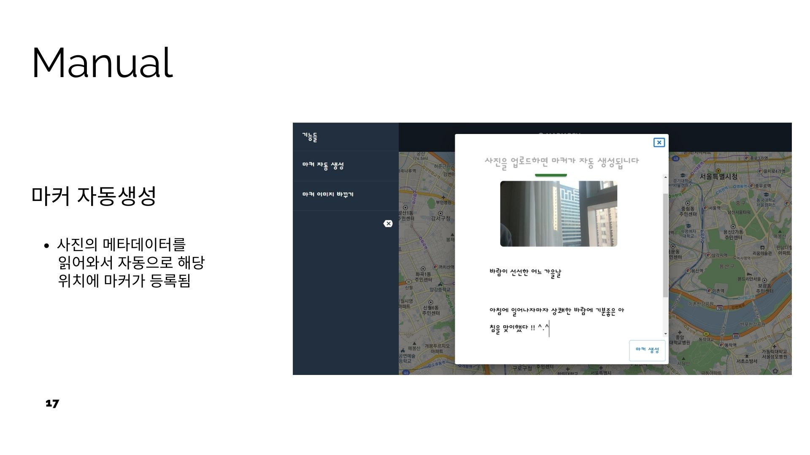

> - 마커가 자동 등록됨

---------------------

- ### 마커 자동 생성
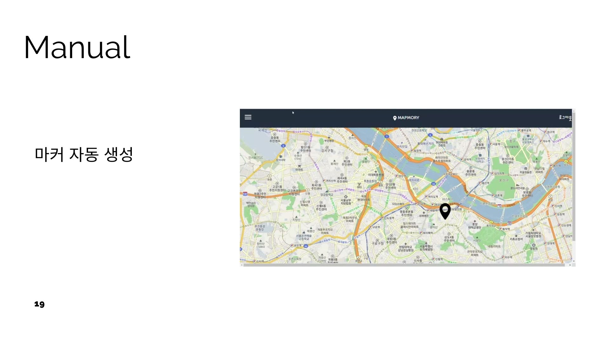

-----------------------
- ### 마커 아이콘 변경
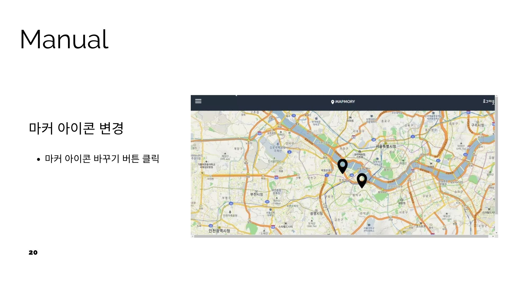
> - 왼쪽 상단의 마커 이미지 변경 버튼 클릭하여 마커 아이콘 변경할 수 있음
---------------------
